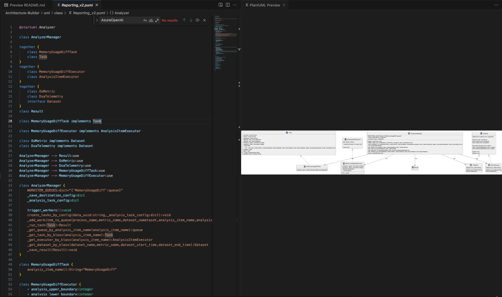
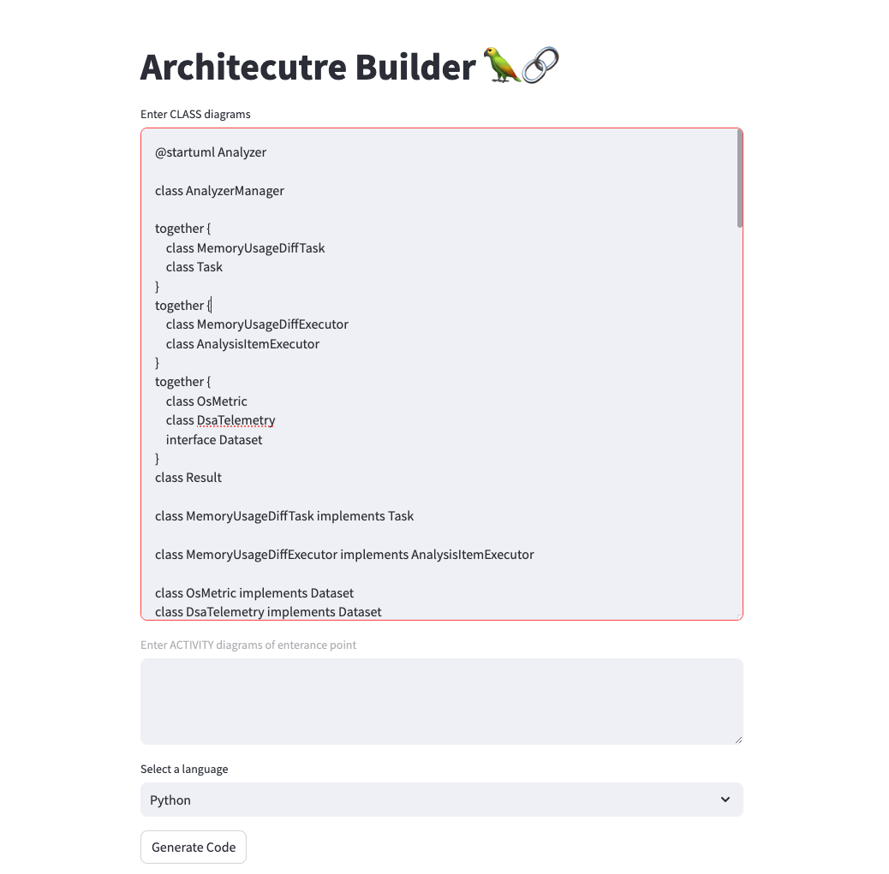
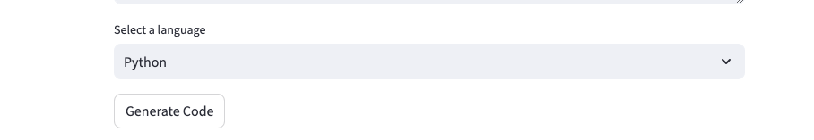
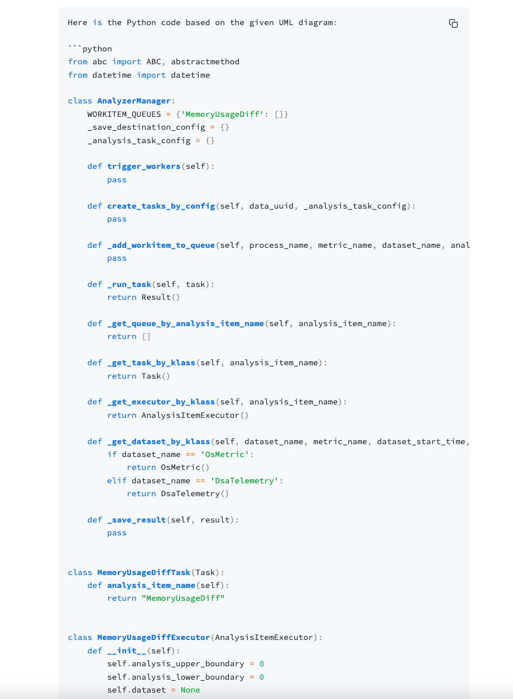

This is **Architecture Builder**, a Streamlit app that utilizes LangChain and Azure OpenAI LLM to generate code from the architecture design of system. It supports using UML CLASS diagrams into Python code.

This is a project to experiment that if it is possible to make developers more focus on system design by shortening time of coding with GPT's help, so that the developers can avoid underdesigned software applications in an Agile team. In this experiment, we use UML diagrams to represent system design.

## Demo
### Prepare UML CLASS diagrams
Click *details* to get example of PlantUML, which is the input of LLM.
<details>
  <code>
    @startuml Analyzer

    class AnalyzerManager

    together {
        class MemoryUsageDiffTask
        class Task
    }
    together {
        class MemoryUsageDiffExecutor
        class AnalysisItemExecutor
    }
    together {
        class OsMetric
        class DsaTelemetry
        interface Dataset
    }
    class Result

    class MemoryUsageDiffTask implements Task

    class MemoryUsageDiffExecutor implements AnalysisItemExecutor

    class OsMetric implements Dataset
    class DsaTelemetry implements Dataset

    AnalyzerManager --> Result:use
    AnalyzerManager --> OsMetric:use
    AnalyzerManager --> DsaTelemetry:use
    AnalyzerManager --> MemoryUsageDiffTask:use
    AnalyzerManager --> MemoryUsageDiffExecutor:use

    class AnalyzerManager {
        WORKITEM_QUEUES:dict="{'MemoryUsageDiff':queue}"
        _save_destination_config:dict
        _analysis_task_config:dict

        trigger_workers():void
        create_tasks_by_config(data_uuid:string,_analysis_task_config:dict):void
        _add_workitem_to_queue(process_name,metric_name,dataset_nametaset,analysis_item_name,analysis_upper_boundary,analysis_lower_boundary):void
        _run_task(Task):Result
        _get_queue_by_analysis_item_name(analysis_item_name):queue
        _get_task_by_klass(analysis_item_name):Task
        _get_executor_by_klass(analysis_item_name):AnalysisItemExecutor
        _get_dataset_by_klass(dataset_name,metric_name,dataset_start_time,dataset_end_time):Dataset
        _save_result(Result):void
    }

    class MemoryUsageDiffTask {
        analysis_item_name():String="MemoryUsageDiff"
    }

    class MemoryUsageDiffExecutor {
        + analysis_upper_boundary:integer
        + analysis_lower_boundary:integer
        + dataset:dataframe
        + _result:Result

        run():_result
    }

    interface AnalysisItemExecutor{
        _result():String="no result yet"

        {abstract}run():void
        get_result:_result
    }

    interface Task {
        + process_name:string
        + metric_name:string
        + datataset_name:string
        + dataset_start_time:datetime
        + dataset_end_time:datetime
        + analysis_upper_boundary:integer
        + analysis_lower_boundary:integer
        + _task:Task
        
        + __init__(process_name,metric_name,datataset_name,dataset_start_time,dataset_end_time,analysis_upper_boundary,analysis_lower_boundary):void
        + create():_task
        + get():_task
        - _verify_parameters():bool
        + {abstract}analysis_item_name():string
    }

    class Result {

    }

    interface Dataset {
        {abstract}datasource_path():void <<property>>
        
        metric():void <<property>>
        start_time():void <<property>>
        end_time():void <<property>>

        metric(val:string):void <<setter>>
        start_time(val:datetime):void <<setter>>
        end_time(val:datetime):void <<setter>>

        load():void
        {abstract}filter():void
    }

    class OsMetric {
        datasource_path:String
        
        datasource_path():String
        filter():dataframe
    }

    class DsaTelemetry {
        datasource_path:String
        
        datasource_path():String
        filter():dataframe
    }

    @enduml
  </code>
</details>



### Paste the UML markdown into UI


### Select language and click "Generate Code" on UI


### Preview code



## Requirements

This app requires the following libraries:

- streamlit
- langchain
- openai
- python-dotenv

## Python Version
This project is compatible with Python 3.10.11.

## Setup

```bash
$ git clone https://github.com/your-username/your-project.git
$ cd your-project
$ pip install -r requirements.txt
```

Set environment variables
```bash
$ export OPENAI_API_TYPE=azure
$ export OPENAI_API_KEY=<your API key>
$ export OPENAI_API_VERSION=<api version>
$ export OPENAI_API_BASE=<your API base>
$ export LLM_DEPLOYMENT_ID=<your llm deployment ID>
$ export LLM_MODEL_NAME=<your llm model name>
```

Run the application
```bash
$ streamlit run main.py
```

## Features:

- **Code Generation**: To generate code from UML diagrams with Azure OpenAI.
- **Code Saving**: To save code as a local file.

## Usage

To use Architecutre Builder, follow these steps:

1. Enter UML giagrams written by PlantUML commands to **Generate** the code.
2. Select the programming language.
3. Click on the **Generate Code** button to generate the code.
4. If you want to run the code, click on the **Run Code** button.
5. If you want to save the code to a file, enter a filename and click on the **Save Code** button.


## Credits
Original Project: <a href="https://github.com/haseeb-heaven/LangChain-Coder" target="_blank">LangChain-Coder
</a>

## Future Works
- Add a new prompt template to generate code entrance point by using UML ACTIVITY diagrams.
- Survey how to use UML to give the comment of APIs.
